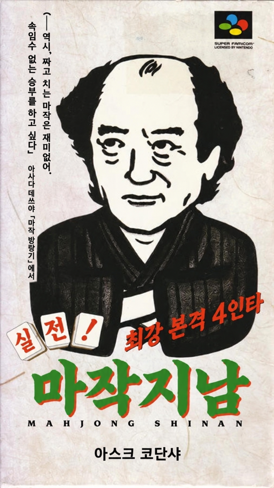
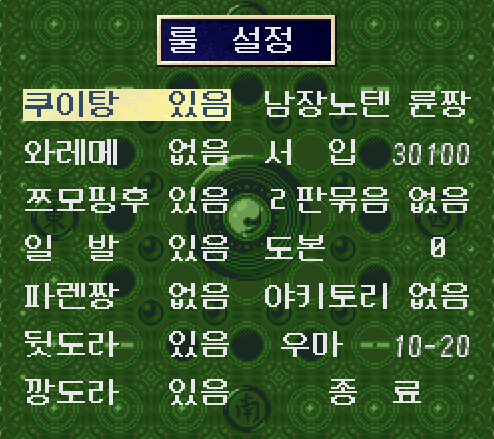

<p align="center"></p>

# 실전! 마작지남 한글 패치

SFC(슈퍼 패미컴) 게임 **実戦！麻雀指南 (Jissen! Mahjong Shinan)** (1995, ASK 코단샤)의 비공식 한글화 패치입니다.

> **현재 버전: v0.9 (베타)** · 번역은 모두 초안이며 사람 검수 전입니다. 확인하지 못한 화면도 있습니다([알려진 한계](#알려진-한계)).

## 버전

v1.0부터 정식판입니다. 번역 검수를 마치고 [알려진 한계](#알려진-한계)의 미확인 화면을 모두 확인하면 v1.0으로 올립니다. 그 전까지는 v0.x 베타입니다.

| 버전 | 상태 | 내용 |
|---|---|---|
| v0.9 | 베타 | 첫 공개판. 모든 텍스트와 그림 글자 한글화(번역 초안), 한글 이름 입력 |

## 패치 적용

패치 파일: [`patch/Jissen_Mahjong_Shinan_KR_v0.9.ips`](patch/Jissen_Mahjong_Shinan_KR_v0.9.ips)

이 패치는 IPS 형식입니다. 게임 ROM은 포함하지 않으며 배포하지도 않습니다.

[Floating IPS](https://github.com/Alcaro/Flips) 같은 IPS 패치 도구로 원본 ROM에 적용하세요.

| 항목 | 값 |
|---|---|
| 대상 파일 | `Jissen! Mahjong Shinan (Japan).sfc` |
| 크기 | 1,048,576바이트 (1MB, 헤더 없음) |
| SHA-1 | `0b7785d0a778f48556d272001010e732b044b396` |

패치 파일과 적용 결과(v0.9):

| 파일 | SHA-1 |
|---|---|
| `Jissen_Mahjong_Shinan_KR_v0.9.ips` | `2cd380b75867945bc1302cfdbf772aca6aff2033` |
| 패치 적용 후 ROM | `be56c529ea9d5835a7f0da9f311718ac482570e2` |

다른 판본이나 512바이트 헤더가 붙은 파일에 적용하면 게임이 깨집니다. 적용 전에 SHA-1을 확인하세요.

## 룰 설정 가이드 (현대 리치마작 기준)

이 게임은 1995년 작품이라 기본 룰이 당시 기준으로 되어 있습니다. 작혼(雀魂) 같은 현대 온라인 마작과는 룰이 다른 부분이 있습니다.
아래처럼 설정하면 현대 4인 반장전 룰에 가깝게 플레이할 수 있습니다.

룰 설정 화면은 프리 대국에서 상대 3명을 고른 뒤에 나옵니다. 방향키 위아래로 항목을 고르고 A 버튼으로 값을 바꿉니다.



### 권장 설정

| 항목 | 기본값 | 권장값 | 고를 수 있는 값 | 비고 |
|---|---|---|---|---|
| 쿠이탕 | 있음 | 있음 | 있음 / 없음 | 변경 없음 |
| 와레메 | 없음 | 없음 | 있음 / 없음 | 변경 없음 |
| 쯔모핑후 | 있음 | 있음 | 있음 / 없음 | 변경 없음 |
| 일발 | 있음 | 있음 | 있음 / 없음 | 변경 없음 |
| 파렌짱 | 없음 | 없음 | 있음 / 없음 | 변경 없음 |
| 뒷도라 | 있음 | 있음 | 있음 / 없음 | 변경 없음 |
| 깡도라 | 있음 | 있음 | 있음 / 없음 | 변경 없음 |
| 남장노텐 | 렌짱 | **륜짱** | 렌짱 / 륜짱 | 유국 때 친이 노텐이면 친이 넘어감 |
| 서입 | 없음 | **30100** | 없음 / 30100 / 33100 / 35100 | 남4국이 끝났을 때 기준 점수에 이른 사람이 없으면 서장에 들어감 |
| 2판묶음 | 없음 | 없음 | 없음 / 5본 | 변경 없음 |
| 도본 | 없음 | **0** | 없음 / 0 / 10000 / 20000 | 점수가 0점 아래로 내려가면 대국 종료 |
| 야키토리 | 없음 | 없음 | 있음 / 없음 | 변경 없음 |
| 우마 | 없음 | **10-20** (또는 10-30) | 없음 / 5-10 / 10-20 / 10-30 | 순위에 따른 가감점 |

기본값은 새로 등록한 슬롯에서 확인한 값입니다.

### 설정 항목 설명

- **남장노텐 (렌짱 / 륜짱)**: 륜짱(輪荘)은 유국 때 친이 노텐이면 친이 다음 사람에게 넘어갑니다. 렌짱(連荘)은 노텐이어도 친이 이어집니다. 현대 룰은 륜짱입니다.
- **서입 (30100)**: 30,000점을 넘겨야(30,100점 이상) 대국이 끝납니다. 이 게임에는 30000 선택지가 없습니다. 작혼은 30,000점 이상이면 끝나므로, 누군가 정확히 30,000점일 때만 결과가 달라집니다.
- **도본 (0)**: 값은 도본이 되는 기준 점수입니다. `0`을 고르면 0점 아래로 내려갔을 때 대국이 끝납니다. 현대 룰과 같은 방식입니다.
- **우마 (10-20)**: 1위 +20, 2위 +10, 3위 -10, 4위 -20. 10-30은 1위 +30, 2위 +10, 3위 -10, 4위 -30입니다.

### 현대 룰과의 차이 (바꿀 수 없는 항목)

- **적도라 없음**: 현대 룰은 적도라 3장(적5만·적5통·적5삭 각 1장)이 기본입니다. 이 게임에는 적도라 설정이 없어서 현대 룰보다 전반적으로 타점이 낮게 나옵니다.

## 번역 방침

- 마작 용어는 일본식 음차를 씁니다(리치, 쯔모, 론, 퐁, 치, 깡 등). 용어 목록은 [`data/glossary.tsv`](data/glossary.tsv)에 있습니다.
- 캐릭터 이름은 일본어 읽기를 그대로 쓰고, 칸에 들어가지 않으면 성만 표시합니다.
- 이름 입력은 한글 음절 격자로 바꿨습니다(170자).
- 결정 사항 전체는 [`docs/decisions.md`](docs/decisions.md)에 있습니다.

## 알려진 한계

- 모든 번역이 초안(`draft`)입니다. 어색한 표현이나 용어 오류가 있을 수 있습니다.
- 확인하지 못한 화면: 단위 심사 합격 경로와 결과 화면, 엔딩·스태프롤(있는지 여부 포함).
- 검증은 snes9x에서만 했습니다. 실기와 다른 에뮬레이터에서는 아직 확인하지 않았습니다.

진행 상황은 [`docs/status.md`](docs/status.md)에 있습니다. 오류를 발견하면 이슈로 알려 주세요.

## 직접 빌드하기

필요한 것: Python 3, Pillow, pytest, 원본 ROM(저장소 루트에 위 파일명으로 둠), 폰트(`.ext/fonts/`).

```sh
python3 tools/extract.py            # 원본 ROM에서 일본어 원문 추출 (text/jp)
python3 tools/tiletext_extract.py
python3 tools/build.py              # build/Jissen_Mahjong_Shinan_KR.sfc, .ips 생성
python3 -m pytest -q tests
```

게임 화면에서 캡처한 타일맵(`data/*map.bin`)은 저장소에 없어서 따로 준비해야 합니다. 자세한 내용은 [`docs/status.md`](docs/status.md)를 보세요.

## 사용한 폰트

모두 SIL Open Font License 1.1입니다.

- [Neo둥근모](https://github.com/neodgm/neodgm): 본문
- [갈무리](https://github.com/quiple/galmuri) (Galmuri11 Bold, Galmuri9): 작은 그림 글자
- [나눔명조](https://hangeul.naver.com/font) ExtraBold: 지남 소개 간판

## 저작권

원작 게임의 권리는 원 권리자에게 있습니다. 이 저장소는 한글화 도구와 번역문만 담고 있으며, ROM이나 원본 데이터 덤프는 포함하지 않습니다.
